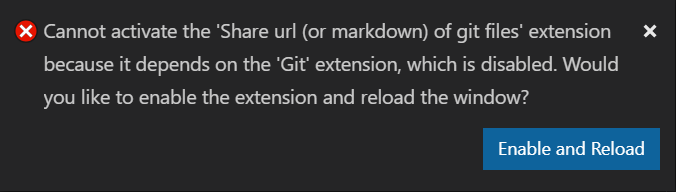

## Features

This extension provides ability to easily get sharable URLs for git files

- Copy (or open) url of active `Editor` document
- Copy a markdown version of active `Editor` document (for sharing with eg Teams)
- Copy url for selected text in active `Editor` document
- Copy (or open) url of selected file/directory in `File Explorer`
- Copy (or open) url of selected tab in `Editor`

## Requirements

You must not disable built-in `Git` extension (which is enabled by default) or you will get following prompt 

## Extension Settings

This extension contributes the following settings:

- `shareGitFile.enableMarkdownSupport`: enable/disable `Copy markdown` support, default on

## Known Issues

- As of release 0.0.4
  - No testing has been performed on non-Windows platform although it should just work (Please report if you found it broken!)
  - Git provider only supports [Azure Repos](https://azure.microsoft.com/en-us/services/devops/repos/) only, but GitHub works as well with auto redirection (except selection)

- Copy markdown 
  - While [Microsoft Teams](https://products.office.com/en-us/microsoft-teams/group-chat-software) supports markdown, it does not format the pasted text as markdown, workaround may be delete the last char and enter it by keyboard
    - Further more, VS Code does not support copy HTML to clipboard and has no plan to do so until it becomes JS standard, see [#77790](https://github.com/microsoft/vscode/issues/77790)
## Release Notes

### 0.0.1

Initial release of share git url extension supporting Azure Repos (partially GitHub).

---
